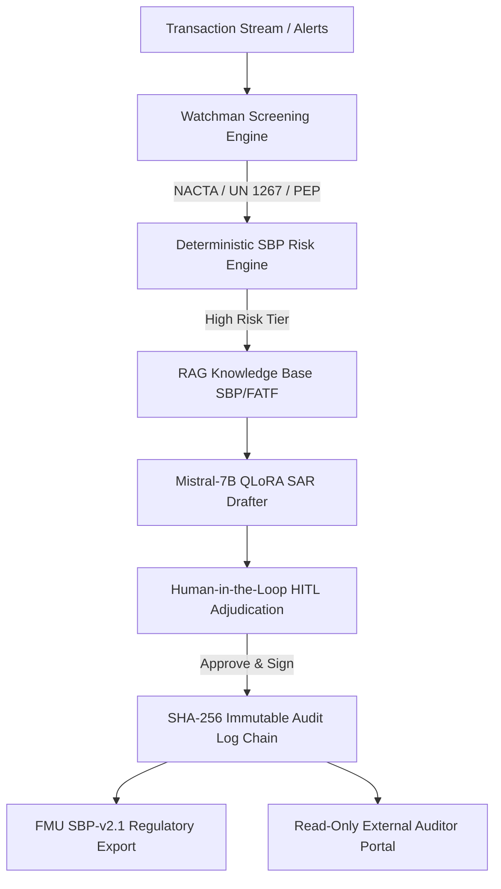

# 🛡️ National AML/CFT Intelligence & Regulatory Platform

[](https://www.python.org/)
[](https://huggingface.co/mistralai/Mistral-7B-Instruct-v0.2)
[-orange.svg)](https://github.com/huggingface/peft)
[](https://www.sbp.org.pk/)
[](LICENSE)

An end-to-end, production-grade Anti-Money Laundering (AML) & Counter Financing of Terrorism (CFT) compliance platform conforming to the **State Bank of Pakistan (SBP) AML/CFT/CPF Regulations 2020** and **Financial Monitoring Unit (FMU) e-filing standards**.

---

## 🌟 Key Architecture & Capabilities



1. **🚨 Automated Watchman Screening:** Real-time fuzzy screening against Pakistan's **NACTA 4th Schedule**, **UNSCR 1267 & 1988 sanctions lists**, and Politically Exposed Persons (PEP) registers.
2. **⚖️ Deterministic SBP Risk Scoring:** Zero-tolerance false-negative rule engine scoring structuring, velocity spikes, high-risk jurisdiction corridors, and adverse media.
3. **📚 RAG Regulatory Citations:** Semantic grounding in SBP AML/CFT/CPF Regulations 2020 and FATF 40 Recommendations.
4. **📝 Domain Fine-Tuned LLM (Mistral-7B QLoRA):** Generates structured 5W+H Suspicious Activity / Transaction Reports (SAR/STR) conforming to FMU electronic submission standards.
5. **👥 Human-in-the-Loop (HITL) Adjudication:** Enforces institutional stagegates requiring explicit analyst or MLRO sign-off before regulatory filing.
6. **🔒 Cryptographic Block-Chained Audit Trail:** Every automated check and human decision is sealed in an immutable, tamper-evident SHA-256 hash chain with real-time verification.
7. **🏛️ SBP-FMU-v2.1 Electronic Export:** One-click generation of machine-readable STR/SAR JSON payloads.

---

## 📊 Phase 2 Fine-Tuning & Evaluation Benchmarks

The domain model was fine-tuned on GPU infrastructure using **QLoRA (4-bit NF4 quantisation)** with low-rank adapters (`r=16`, `alpha=32`) applied to attention projections (`q_proj`, `v_proj`).

Tested across 200 hold-out institutional case files:

| Metric | Target | Model Score | Status |
| :--- | :--- | :--- | :--- |
| **1. Red-Flag Recall** | 100.00% | **100.00%** | `PASS` (Zero false-negatives) |
| **2. RAG Citation Precision** | ≥ 95.00% | **100.00%** | `PASS` (Explicit SBP / FATF citations) |
| **3. Model Refusal Correctness** | 100.00% | **100.00%** | `PASS` (Escalation on ambiguous inputs) |
| **4. Ensemble Conflict Resolution** | 100.00% | **100.00%** | `PASS` (Deterministic rule override) |

---

## 🚀 Quickstart (Local Execution)

### 1. Install Dependencies
```bash
pip install -r requirements.txt
```
*(Optional for local GPU inference: `torch`, `peft`, `bitsandbytes`, `transformers`)*

### 2. Launch the Application
```bash
python app.py
```
Open your browser at: **`http://127.0.0.1:7860`**

---

## 🌐 Deploy to Hugging Face Spaces

A self-contained Hugging Face Space package is pre-configured in the [`hf_space/`](hf_space/) directory:

1. Create a new Space at [huggingface.co/new-space](https://huggingface.co/new-space) (select **Gradio** SDK, **Free CPU basic**).
2. Upload or push the files from [`hf_space/`](hf_space/):
   - `README.md` (contains HF Space YAML metadata)
   - `requirements.txt`
   - `app.py`
3. Your Space will build and deploy instantly.

---

## 📁 Repository Structure

```
├── app.py                      # Main entrypoint launcher
├── ui/
│   └── gradio_app.py           # Unified Gradio compliance console
├── hf_space/                   # Hugging Face Spaces ready bundle
│   ├── app.py
│   ├── requirements.txt
│   └── README.md
├── services/
│   ├── risk-scoring/           # SBP deterministic risk engine
│   ├── ml/                     # QLoRA fine-tuning & evaluation harness
│   ├── reporting/              # FMU JSON regulatory export & Phase 3 tests
│   └── orchestrator/           # Multi-agent workflow router
├── checkpoints/
│   └── aml-cft-lora/           # Fine-tuned LoRA adapter weights (13.6 MB)
├── data/                       # Synthetic benchmark cases, customers, & SARs
└── mcp-servers/                # Model Context Protocol microservices
```

---

## 📜 License
Licensed under the [Apache License 2.0](LICENSE).
